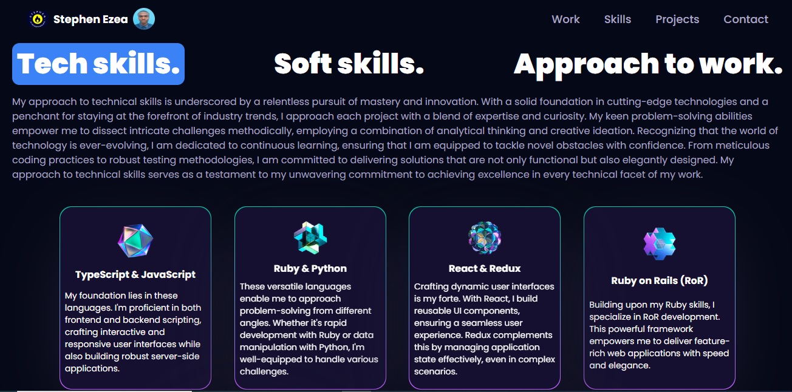

<!-- TABLE OF CONTENTS -->
# 📗 Table of Contents

- [📖 About the Project](#about-project)
  - [🛠 Built With](#built-with)
    - [Project Preview](#schema)
    - [Tech Stack](#tech-stack)
    - [Key Features](#key-features)
  - [🚀 Live Demo](#live-demo)
  - [🚀 Frontend Link](#frontend-link)
- [💻 Getting Started](#getting-started)
  - [Setup](#setup)
  - [Prerequisites](#prerequisites) 
  - [Deployment](#triangular_flag_on_post-deployment)
- [👥 Authors](#authors)
- [🔭 Future Features](#future-features)
- [🤝 Contributing](#contributing)
- [⭐️ Show your support](#support)
- [🙏 Acknowledgements](#acknowledgements)
- [❓ FAQ (OPTIONAL)](#faq)
- [📝 License](#license)

<!-- PROJECT DESCRIPTION -->

# 📖 Modern 3D Portfolio

**Modern 3D Portfolioe** Immerse viewers in a state-of-the-art 3D portfolio built with ReactJS, Redux, React Three Fiber, React Three Drei, Framer Motion, JavaScript, and Tailwind CSS. Seamlessly navigate projects through dynamic ReactJS and Redux integration, ensuring efficient state management for a smooth user experience. Leveraging React Three Fiber and React Three Drei libraries, the portfolio presents lifelike 3D graphics for an immersive display of architectural, product, and creative works. Framer Motion adds fluid animations, enhancing user engagement. JavaScript powers custom functionalities, while Tailwind CSS ensures responsive design across devices. This synergy creates an exceptional showcase of creativity, setting your portfolio apart in the digital landscape with a perfect blend of technology and aesthetics.

## 🛠 Built With 

### Project Preview 

### Tech Stack 

Client

  <ul>
    <li><a href="https://react.dev/blog/2023/03/16/introducing-react-dev">React</a></li>
     <li><a href="https://docs.pmnd.rs/react-three-fiber/getting-started/introduction">Threejs</a></li>
     <li><a href="https://redux.js.org/">Redux</a></li>
     <li><a href="https://tailwindcss.com/">TailwindCSS</a></li>
  </ul>

<!-- Features -->

### Key Features 
"Experience a cutting-edge 3D portfolio like no other, meticulously crafted using the latest web technologies. Our portfolio is built using ReactJS as the foundation, allowing for a dynamic and responsive user interface. The integration of Redux ensures efficient state management, enabling seamless navigation and interactions throughout the experience.

Step into a world of immersive 3D graphics powered by React Three Fiber and React Three Drei libraries. Showcase your work with lifelike depth and realism, captivating visitors with interactive and visually stunning representations of your projects. From architectural visualizations to product designs, the possibilities are limitless.

The motion design of the portfolio is elevated through Framer Motion, adding fluid animations and transitions that breathe life into your projects. Users will be captivated by the smooth and engaging movements that guide them through your portfolio, creating an unforgettable browsing experience.

Under the hood, JavaScript plays a crucial role in implementing custom functionalities and interactions. This ensures that your portfolio not only looks exceptional but also functions flawlessly, catering to a seamless user experience. Meanwhile, Tailwind CSS provides a strong foundation for responsive and aesthetically pleasing design, making sure your portfolio looks stunning across various devices and screen sizes.
- **It provides feedback on the user's answers, indicating whether they are correct or incorrect**

(<a href="#readme-top">back to top</a>)

<!-- LIVE DEMO -->
## 🚀 LIVE DEMO 
- [Link to Live Demo](https://interactive-game-quiz.netlify.app/)

(<a href="#readme-top">back to top</a>)

(<a href="#readme-top">back to top</a>)

<!-- AUTHOR-->

👤 **Ezea Stephen Nnabuike**

- GitHub: [@stephnna](https://github.com/stephnna)
- Twitter: [@stephnna](https://twitter.com/stephnna)
- LinkedIn: [LinkedIn](https://www.linkedin.com/in/stephen-ezea/)

(<a href="#readme-top">back to top</a>)

<!-- CONTRIBUTING -->

## 🤝 Contributing 

Contributions, issues, and feature requests are welcome!

Feel free to check the [issues page](../../issues/).

(<a href="#readme-top">back to top</a>)

<!-- SUPPORT -->

## ⭐️ Show your support 

If you like this project kindly star the project

(<a href="#readme-top">back to top</a>)

<!-- ACKNOWLEDGEMENTS -->

## 🙏 Acknowledgments 

We would like to thank Believers tech Network who came up with project idea.
View the full [project task](https://docs.google.com/document/d/1_e75wXocwZF-IdeqDwvWR52deU34gGokVGthlI-MmAk/edit#heading=h.3qmrs766hafj) description 

(<a href="#readme-top">back to top</a>)

(<a href="#readme-top">back to top</a>)

